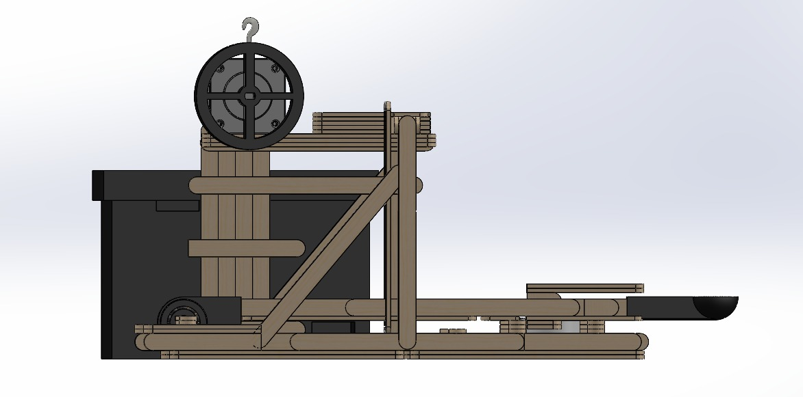
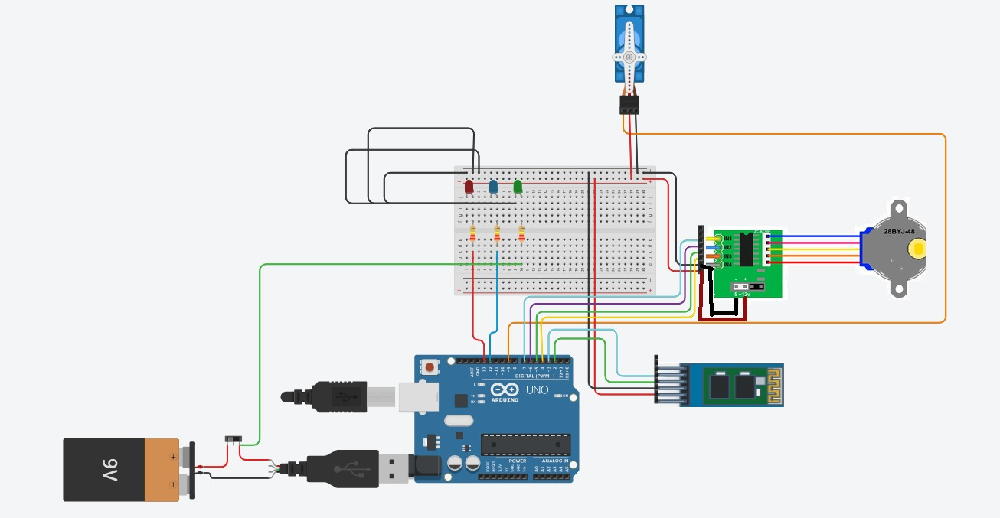

# LEVIATHAN — Catapulta IME 2026

Catapulta automatizada de precisão construída em palitos de picolé, controlada pelo celular via Bluetooth. Projeto da disciplina **Introdução a Projetos de Engenharia (IPE 1)** — Instituto Militar de Engenharia, Turma B2, 2026.

O sistema acerta alvos entre **0,5 m e 4 m**, com alcance definido por software: o operador escolhe a distância no app, e o firmware traduz o valor no número de passos do motor que tensiona o elástico. Alimentação autônoma por pilhas, sem conexão à rede elétrica durante a competição.

<p align="center">
  
</p>

---

## Sobre o projeto

A catapulta é do tipo **alavanca articulada sobre rolamento**, com estrutura em palitos de picolé unidos por adesivo de alta resistência. A propulsão vem de elásticos de látex tensionados por um motor de passo; um segundo motor de passo trava e solta o braço de lançamento. O ângulo de disparo é fixo estruturalmente — o alcance é ajustado apenas pelo número de passos do motor tensionador, calibrado experimentalmente.

O planejamento seguiu boas práticas do Guia PMBOK® (declaração de escopo, EAP, cronograma, baseline de custos, matriz de risco e matriz de responsabilidades), documentadas no plano de projeto do grupo.

## Decisões de engenharia

**Plataforma de controle: Arduino UNO no lugar do ESP32.** A avaliação inicial partiu do ESP32, mas a plataforma definitiva passou a ser o Arduino UNO com módulo Bluetooth externo. O motivo foi a ampla disponibilidade de documentação e bibliotecas consolidadas para controle de motores de passo, além da maior familiaridade da equipe — o que reduziu a curva de aprendizado e os pontos de falha na integração eletromecânica, sem comprometer os requisitos, a custo líquido zero.

**Aprendizado da execução: o gargalo foi a estrutura, não o código.** A expectativa inicial era que a programação embarcada fosse a maior dificuldade. Na prática, a fragilidade da estrutura em palitos exigiu reforços não previstos na modelagem inicial e reconstrução de partes da base — o material mais simples do projeto acabou ditando o teto de precisão do sistema.

---

## Arquitetura do sistema

```
App Flutter (Android)  ──Bluetooth SPP──►  Arduino UNO  ──►  Motor 1 (tensiona o elástico)
CONTROLE / CALIBRAÇÃO                        │           ──►  Motor 2 (trava e solta o braço)
│           ──►  LEDs de estado (verde / vermelho)
```

O app envia comandos numéricos por Bluetooth clássico; o firmware interpreta cada comando, aciona os motores de passo e sinaliza o estado por LEDs.

## Hardware

| Componente | Função |
|---|---|
| Arduino UNO | Microcontrolador principal |
| Módulo Bluetooth HC-06 | Comunicação serial clássica (SPP) com o celular |
| Motor de passo 1 (28BYJ-48) | Tensiona o elástico — define o alcance |
| Motor de passo 2 (28BYJ-48) | Trava e solta o braço de lançamento |
| 2× Driver ULN2003 | Aciona os motores de passo |
| LED verde (pino 12) | Sistema tensionado / pronto |
| LED vermelho (pino 13) | Em operação; pisca aguardando o comando de reset |
| Elástico de látex | Elemento de propulsão |
| Esfera de aço | Projétil (fornecido pelos professores) |

### Mapeamento de pinos

| Sinal | Pinos Arduino |
|---|---|
| Motor 1 — tensiona o elástico | 8, 9, 10, 11 |
| Motor 2 — trava / solta o braço | 4, 6, 5, 7 |
| Bluetooth (SoftwareSerial) | 2 (RX), 3 (TX) |
| LED verde | 12 |
| LED vermelho | 13 |

<p align="center">
  
</p>

---

## Protocolo Bluetooth

Os comandos são enviados pelo app como números inteiros seguidos de `\n`. O sistema tem dois modos e inicia sempre em **calibração**, por segurança.

### Comandos de modo

| Valor | Ação |
|---|---|
| `503` | Entra em modo **Calibração** |
| `504` | Entra em modo **Normal** |

### Modo Normal (operação)

| Valor | Ação |
|---|---|
| `0`–`100` | Define o alcance alvo (mapeado para 0–2048 passos do Motor 1) |
| `101` | Tensiona o elástico até o valor definido |
| `102` | Solta o braço (dispara) e entra em espera — LED vermelho pisca |
| `103` | Reset — Motor 1 e Motor 2 retornam à posição inicial |

**Fluxo de uso:**

```
1. Enviar 504      →  entra em modo normal
2. Enviar 0–100    →  define a distância alvo
3. Enviar 101      →  tensiona o elástico
4. Enviar 102      →  dispara
5. Enviar 103      →  reseta para o próximo lançamento
```

### Modo Calibração

| Valor | Ação |
|---|---|
| `1`–`9999` | Envia passos brutos direto ao Motor 1 (aferição) |
| `102` | Solta o braço e entra em espera — LED vermelho pisca |
| `103` | Retorna os motores à posição inicial |

Use o modo calibração para levantar a relação **passos × distância real**, medir onde a esfera cai e ajustar as constantes do firmware.

> **Observação:** o firmware não devolve mensagens de texto pelo Bluetooth. A confirmação de estado é feita pelos LEDs (verde = tensionado/pronto; vermelho fixo = em operação; vermelho piscando = aguardando `103`).

---

## Estrutura do repositório

```
catapulta/
├── lib/src/
│   ├── pages/
│   │   ├── home_page.dart          # Tela principal (LEVIATHAN)
│   │   ├── calibracao_page.dart    # Tela de calibração (passos manuais)
│   │   ├── devices_page.dart       # Seleção do dispositivo Bluetooth
│   │   └── main_page.dart          # Navegação entre telas
│   ├── controllers/
│   │   └── catapult_controller.dart
│   └── services/
│       └── bluetooth_service.dart
├── arduino/
│   └── catapulta_arduino/
│       └── catapulta_arduino.ino   # Firmware Arduino UNO
├── assets/icon/
│   └── leviathan_icon.png
├── android/
└── pubspec.yaml
```

---

## App Flutter — LEVIATHAN

Aplicativo Android que controla toda a operação por Bluetooth clássico (BT 2.x).

- **Tela CONTROLE:** define a distância, tensiona, dispara e reseta.
- **Tela CALIBRAÇÃO:** envia número de passos manualmente para aferir a relação passos × distância.

### Gerar o APK

```bash
cd catapulta
flutter pub get
flutter build apk --release --target-platform android-arm64   # 64-bit
flutter build apk --release --target-platform android-arm     # 32-bit
```

---

## Calibração do alcance

As constantes a ajustar no firmware são:

```cpp
const long PASSOS_MIN = 256;   // passos para lançar ~0,5 m
const long PASSOS_MAX = 2048;  // passos para lançar ~4,0 m
```

Pela tela de Calibração do app, envie passos manuais, meça a distância real e ajuste as constantes até os resultados baterem com as distâncias-alvo.

---

## Requisitos atendidos

| Requisito | Status | Detalhe |
|---|---|---|
| R1 — Materiais fornecidos | ✅ | Palitos, Arduino, motores, elástico, esfera |
| R2 — Controle pelo celular | ✅ | App Flutter via Bluetooth |
| R3 — Alimentação por pilhas | ✅ | Operação autônoma, sem tomada |
| R4 — Alcance de 0,5 a 4 m | ✅ | Mapeado de 0 a 100% no protocolo |
| R5 — Alvo no mesmo nível | ✅ | Considerado no projeto mecânico |
| R6 — Esfera de aço | ✅ | Projétil fornecido pelos professores |

---

## Equipe — Turma B2

- Gustavo Alves — documentação e audiovisual
- Miguel Sadoc — firmware / Arduino
- Nicolas Negreli — engenharia mecânica
- Pedro Nojima — testes e calibração
- Peryllo Vargas — aquisições e logística
- Raimundo Nonato — liderança e integração

---

*Projeto acadêmico — Instituto Militar de Engenharia (IME), 2026.*
